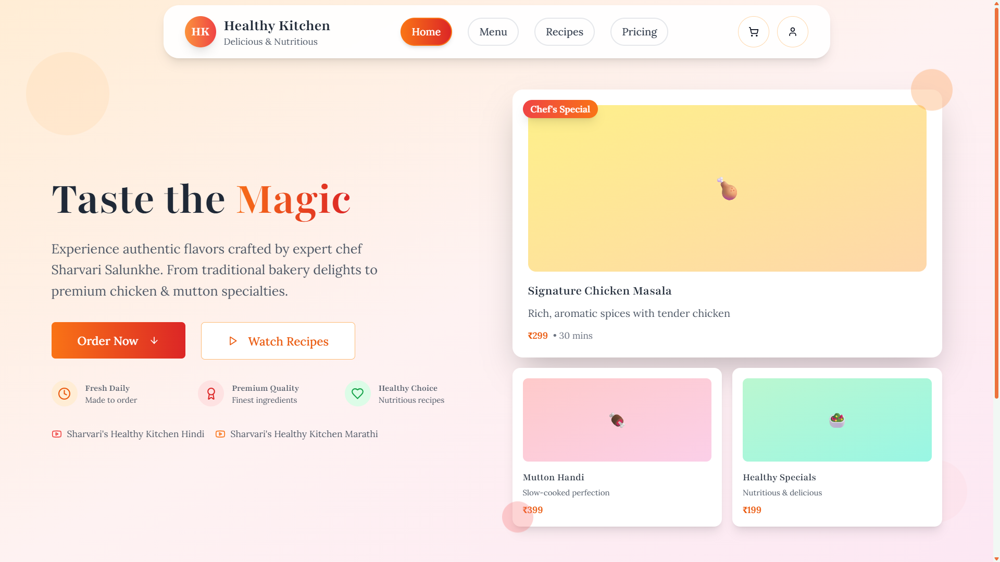
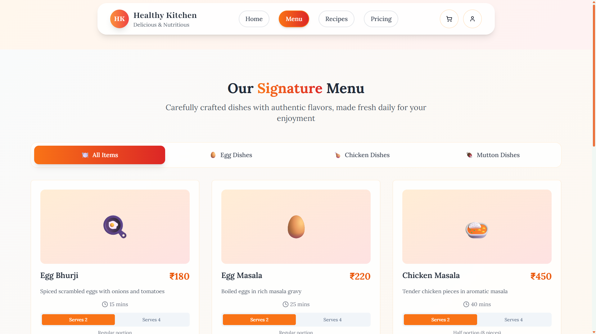

# 🍽️ Healthy Kitchen

  
A modern web application for discovering and managing healthy recipes

  
  
  
  
    

## 📸 Screenshots

  
### 🏠 Home Page
*Experience authentic flavors crafted by expert chef Sharvari Salunkhe*

### 🍽️ Menu Page  
*Browse our carefully crafted signature menu with authentic dishes*

**Key Features Showcased:**
- 🍳 **Signature Dishes**: Egg Bhurji, Egg Masala, Chicken Masala with authentic recipes
- 🎨 **Modern UI**: Clean, intuitive design with beautiful card layouts  
- 📊 **Detailed Info**: Pricing, cooking time, and portion information
- 🔄 **Category Filters**: Easy navigation between Egg, Chicken, and Mutton dishes
- 📱 **Responsive Cards**: Optimized display for all screen sizes

## ✨ Features

- 🥗 **Recipe Discovery** - Browse curated healthy recipes
- 🛒 **Shopping Cart** - Easy meal planning and ingredient management  
- 👤 **Personal Recipes** - Create and save your own recipes
- 🔍 **Smart Search** - Filter by ingredients, diet, and preferences
- 📱 **Responsive Design** - Works on all devices

## 🛠️ Tech Stack

- **React 18** + **TypeScript** for robust UI development
- **Vite** for fast development and building
- **Tailwind CSS** + **shadcn/ui** for modern styling
- **Supabase** for backend and database
- **React Router** for navigation

## 📄 License

This project is licensed under the MIT License - see the [LICENSE](LICENSE) file for details.

---

  
Made with ❤️ by the Healthy Kitchen team

  <h2>🍽️ Made with ❤️ by the Healthy Kitchen team 🍽️</h2>
  

    <strong>Bon Appétit! Happy Coding! Happy Cooking!</strong>
  

  
   
  
  <strong>🌟 Star this repo if you love healthy cooking! 🌟</strong>
   
  <em>Together, let's make the world a healthier and tastier place! 🌍🥗</em>

---

  <strong>🍴 See you in the kitchen! 🍴</strong>

